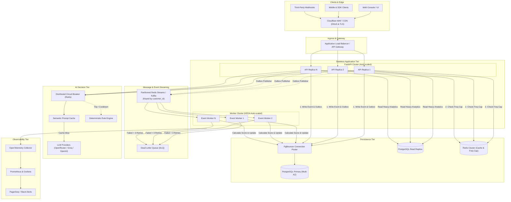

# Production Readiness & Architecture Roadmap

This document outlines the gap between the current all-in-one prototype and an enterprise-grade production deployment for the **MarTech Intelligence & Campaign Decision Engine**. It details current capabilities, required changes, operational costs, a step-by-step Pull Request (PR) roadmap, and the production target architecture.

---

## 1. Executive Summary: What It Is vs. What It Actually Does

| Dimension | Current Prototype / Demo | Production Target |
| :--- | :--- | :--- |
| **Deployment Model** | Single self-contained Docker container on Render free tier. | Decoupled microservices on Kubernetes (EKS/GKE) or AWS ECS. |
| **Database** | Embedded local PostgreSQL instance inside container (single process, ephemeral disk). | Managed Multi-AZ PostgreSQL (AWS Aurora / Cloud SQL) with PgBouncer, automated failover, and point-in-time recovery (PITR). |
| **Message Broker** | Embedded local Redis server running Redis Streams. | Managed Redis Cluster (AWS ElastiCache / Redis Enterprise) or Apache Kafka for multi-partition streaming. |
| **Workers** | In-process `asyncio.create_task` embedded inside FastAPI. | Standalone autoscaled worker fleet scaled via KEDA based on stream consumer group lag. |
| **Throughput Capacity** | ~50–150 events/sec sustained (bounded by container CPU/RAM and single worker loop). | 10,000–50,000+ events/sec across partitioned topics and parallel worker pools. |
| **Fault Isolation** | None: If PostgreSQL or Redis crashes, the entire container and API crash. | Strict fault isolation: API, worker fleet, database, and cache scale and fail independently. |
| **Authentication** | Single static `API_KEY` header check; optional in development mode. | Multi-tenant RBAC, JWT / OAuth2 bearer tokens, hashed API keys (`argon2id`), and secret management via Vault/AWS Secrets Manager. |
| **AI Evaluation** | Direct API calls to OpenRouter/Groq with in-memory process-local circuit breaker. | Distributed circuit breaker, semantic caching (Redis vector store), model fallback chain, prompt validation, and rate/budget caps. |
| **Observability** | Stdout logging and `/system/health` polling. | OpenTelemetry distributed tracing, Prometheus metrics exporter, structured JSON logging, and PagerDuty alert rules. |

---

## 2. What Needs to Be Changed: Gap Analysis

### A. Infrastructure & Compute
1. **Decouple API and Worker Processes**:
   - In production, running background workers inside the web server process risks dropped events during web restarts, deploys, or health-check kills.
   - Separate into two distinct artifacts:
     - `martech-api`: Handles HTTP ingress, validates events, writes to DB outbox, serves UI and queries.
     - `martech-worker`: Reads outbox, publishes to stream, consumes events, computes scores, and updates customer timelines.
2. **Externalize Databases & Caches**:
   - Replace the embedded Postgres daemon in [backend/scripts/start.sh](file:///Users/ayanshah/Desktop%20Folders/Spinach%20Test/backend/scripts/start.sh) with a managed PostgreSQL 16+ instance.
   - Replace embedded Redis with a managed Redis Cluster or Amazon ElastiCache with multi-AZ replication.
3. **Container Resource Allocation**:
   - Current limits: Render free tier (512 MB RAM, shared vCPU).
   - Production target: 2+ replicas of API (1 GB RAM, 0.5 vCPU each), 3+ replicas of Worker (1–2 GB RAM, 1 vCPU each).

### B. Scalability & Streaming
1. **Stream Partitioning**:
   - The current Redis Streams setup uses a single stream (`events:stream`). This creates an ordering bottleneck when scaling to multiple workers.
   - **Production change**: Partition events across streams or swap to Apache Kafka using `app/queue/kafka_adapter.py` keyed by `customer_id`. This guarantees per-customer FIFO ordering while allowing parallel processing across dozens of consumer nodes.
2. **Database Connection Pooling**:
   - Direct connection from hundreds of async worker tasks can exhaust PostgreSQL's `max_connections`.
   - Deploy PgBouncer in transaction-pooling mode between FastAPI/workers and PostgreSQL.

### C. Security & Compliance
1. **Secrets Management**:
   - Remove environment variable plaintext storage. Inject secrets via AWS Secrets Manager, HashiCorp Vault, or Doppler.
2. **Tenant Isolation & RBAC**:
   - Introduce tenant IDs on all tables (`customers`, `events`, `campaigns`) with Row-Level Security (RLS) in PostgreSQL.
   - Replace single static key with scoped API keys (`events:ingest`, `campaigns:read`, `ai:analyze`).
3. **Network Security**:
   - Restrict database and Redis ports to VPC private subnets.
   - Enforce mTLS for internal service-to-service communication.
   - Enforce Cloudflare / WAF with DDoS protection, bot detection, and rate limiting (600 requests/min per IP/token).

### D. Observability & Reliability
1. **Distributed Tracing**:
   - Integrate OpenTelemetry (OTel) context propagation across HTTP request → Outbox row → Stream message → Worker processor → AI call.
2. **Prometheus Metrics**:
   - Expose `/metrics`:
     - `events_ingested_total` (by channel, event_type)
     - `event_processing_duration_seconds` (histogram)
     - `stream_consumer_lag` (gauge)
     - `dlq_events_total` (counter)
     - `llm_request_duration_seconds` and `llm_fallback_total`
3. **Centralized Logging**:
   - Structured JSON logs with `trace_id`, `span_id`, `customer_id`, and `event_id` shipped to Datadog, Grafana Loki, or AWS CloudWatch.

---

## 3. Production Architecture Diagram

---

## 4. What PRs Will Do: Pull Request Roadmap

To migrate from the current code to this production architecture, work should be broken down into 5 self-contained, reviewable PRs:

### PR 1: Service Decoupling & Managed Infrastructure Config
- **Files Changed**:
  - `backend/Dockerfile.api` and `backend/Dockerfile.worker`
  - `render.yaml` (or Terraform / Kubernetes manifests)
  - `backend/app/main.py`
- **What it does**:
  - Separates the Docker image into an API container and a dedicated Worker container.
  - Removes embedded postgres and redis processes from Dockerfile.
  - Updates `main.py` so `RUN_EMBEDDED_WORKER` defaults to `false` in production.
  - Adds healthcheck probes tailored for both services (`/live` for API, process heartbeat check for worker).

### PR 2: Partitioned Event Ingestion & Kafka/Redis Cluster Adapter
- **Files Changed**:
  - `backend/app/queue/redis_streams.py`
  - `backend/app/queue/kafka_adapter.py`
  - `backend/app/workers/event_worker.py`
- **What it does**:
  - Implements multi-partition sharding using consistent hashing on `customer_id`.
  - Implements consumer group claim balancing and crash-recovery rebalancing.
  - Fully wires `kafka_adapter.py` for enterprise environments requiring 10,000+ events/sec.

### PR 3: Production Security, RBAC & Secret Management
- **Files Changed**:
  - `backend/app/core/security.py`
  - `backend/app/core/config.py`
  - `backend/app/db/models.py` (Tenant & API Key tables)
  - `backend/migrations/versions/` (New Alembic migration)
- **What it does**:
  - Replaces single static `API_KEY` with multi-tenant hashed API keys (`argon2id`) supporting expiration and permission scopes (`events:write`, `campaigns:read`).
  - Implements tenant ID filtering via SQLAlchemy event listeners or Postgres Row-Level Security (RLS).
  - Integrates AWS Secrets Manager / Vault client for dynamic secret fetching.

### PR 4: Full Observability (OpenTelemetry, Prometheus & Logging)
- **Files Changed**:
  - `backend/app/main.py`
  - `backend/app/core/telemetry.py` (New)
  - `backend/app/workers/event_worker.py`
  - `backend/requirements.txt`
- **What it does**:
  - Installs `opentelemetry-api`, `opentelemetry-sdk`, and `prometheus-fastapi-instrumentator`.
  - Adds `/metrics` endpoint with counters, duration histograms, and queue lag gauges.
  - Configures JSON structured logging with trace ID propagation across async tasks.

### PR 5: Data Retention, Partitioning & Disaster Recovery
- **Files Changed**:
  - `backend/migrations/versions/` (Partition `events` table)
  - `backend/scripts/prune_outbox.py`
  - `backend/scripts/backup_verification.sh`
- **What it does**:
  - Implements native PostgreSQL table partitioning by date range (`timestamp`) on `events`.
  - Automates cleanup of processed outbox entries older than 7 days.
  - Implements cold archival script dumping historical records to S3/GCS as Parquet files.

---

## 5. Cost & Resource Comparison

| Tier | Estimated Monthly Cost | Target Workload |
| :--- | :--- | :--- |
| **Current Prototype** | **$0 / month** (Render Free Tier) | Proof of concept, local evaluation, portfolio demo (< 1,000 events/day). |
| **Entry Production** | **~$60–$150 / month** - Managed Postgres (Neon / Supabase Pro): $25 - Upstash / Redis Cloud: $10 - 2x API Web Instances: $14 - 1x Worker Instance: $7 | Up to 1,000,000 events/month, 50 concurrent requests, small marketing team. |
| **High-Scale Enterprise** | **~$800–$2,500 / month** - AWS Aurora Multi-AZ: $350 - AWS ElastiCache Cluster: $180 - EKS / ECS Worker Fleet: $400 - Cloudflare Enterprise / WAF: $200 - OpenRouter / LLM Tokens: Usage-based | 100,000,000+ events/month, multi-tenant enterprise SLA (99.95%), automated failover. |
