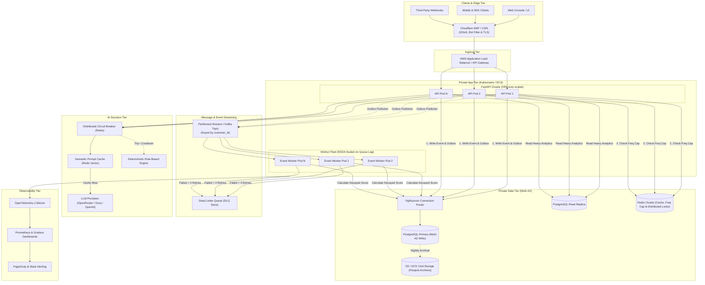

# Production Readiness & Architecture Roadmap

> An enterprise architectural evaluation and transition roadmap for the **MarTech Intelligence & Campaign Decision Engine**, structured using the **4W & 1H (What, Why, Who, Where, How)** engineering framework.

---

## 4W & 1H Framework Executive Summary

```
┌─────────────────────────────────────────────────────────────────────────────┐
│  WHAT:   Enterprise migration plan from all-in-one demo to scalable cloud   │
│  WHY:    Fault isolation, 50,000+ events/sec throughput, zero data loss SLA │
│  WHO:    Platform Engineers, DevOps/SREs, Lifecycle Marketers, SecOps       │
│  WHERE:  AWS / GCP Multi-AZ, VPC private subnets, Kubernetes, Edge WAF      │
│  HOW:    5-phase Pull Request (PR) roadmap, OTel metrics, Kafka/PgBouncer   │
└─────────────────────────────────────────────────────────────────────────────┘
```

---

## 1. WHAT: Capabilities & Production Gap Analysis

### What It Is Today vs. What It Actually Does

| Dimension | Current Prototype / Demo | What It Actually Does Today | Production Target |
| :--- | :--- | :--- | :--- |
| **Deployment Model** | Single Docker container on Render Free Tier. | Runs FastAPI, embedded Postgres, embedded Redis, and background worker in 1 container. | Decoupled microservices on Kubernetes (EKS/GKE) or AWS ECS. |
| **Database** | Embedded PostgreSQL daemon inside container. | Stores events, outbox, customers, and campaigns on an ephemeral container filesystem. | Managed Multi-AZ PostgreSQL 16+ (AWS Aurora / Cloud SQL) with automated failover and PITR. |
| **Message Broker** | Embedded local Redis server. | Powers Redis Streams (`events:stream`) for worker consumption. | Managed Redis Cluster (AWS ElastiCache) or Apache Kafka for multi-partition streaming. |
| **Worker Engine** | In-process `asyncio.create_task`. | Asynchronously processes outbox rows, calculates decayed scores, updates customer records. | Standalone autoscaled worker fleet scaled via KEDA based on stream consumer lag. |
| **Throughput** | ~50–150 events/sec. | Sufficient for interactive demo and small batch testing. | 10,000–50,000+ events/sec across partitioned topics and parallel worker pools. |
| **Fault Isolation** | Zero isolation. | If Postgres or Redis runs out of memory (512MB RAM limit), the API crashes. | Independent failure domains: API, workers, databases, and caches fail and scale independently. |
| **Authentication** | Single static `API_KEY` header. | Simple header check, disabled in development mode. | Multi-tenant RBAC, JWT / OAuth2 bearer tokens, hashed API keys (`argon2id`), KMS secrets. |
| **AI Evaluation** | Direct API calls to OpenRouter/Groq. | Rule-based summary fallback with in-memory process-local circuit breaker. | Distributed circuit breaker (Redis), semantic prompt cache, token budgeting, and fallback chain. |
| **Observability** | Stdout logs + `/system/health`. | Basic health JSON response and container logs. | OpenTelemetry distributed tracing, Prometheus metrics exporter, structured JSON logs, and PagerDuty. |

### What Needs to Be Changed (The Production Gaps)
1. **Decouple the Compute Tier**: The background worker must not share process space or container lifecycles with the public HTTP API.
2. **Externalize State**: Eliminate embedded database and Redis daemons in favor of managed, persistent, multi-AZ cloud services.
3. **Partition Message Streaming**: Replace the single Redis stream with partitioned streams or Apache Kafka keyed by `customer_id` to enable horizontal consumer scaling.
4. **Harden Security & Secrets**: Move away from plaintext `.env` variables to KMS/Vault secret injection; replace single API keys with scoped, multi-tenant tokens.
5. **Implement Data Lifecycle Policies**: Add table partitioning to `events` and automate outbox pruning and cold-storage S3 Parquet archiving.

---

## 2. WHY: Architectural Rationale & Motivations

### Why Decouple API and Worker Fleets?
In the current prototype, a sudden spike in event ingestion or worker scoring can consume all CPU/RAM, causing the web API to fail health checks and restart. Decoupling ensures:
- Ingestion APIs remain responsive even during heavy background processing.
- Workers can be scaled independently using KEDA based strictly on queue backlog (`xlen` / `pending`).
- Deployments to the web API do not terminate in-flight event processing tasks.

### Why Managed Multi-AZ PostgreSQL with PgBouncer?
- **Zero Data Loss**: Automated point-in-time recovery (PITR) and synchronous multi-AZ replication protect against hardware failure.
- **Connection Saturation**: Hundreds of async worker tasks can quickly exhaust PostgreSQL's `max_connections`. Deploying PgBouncer in transaction-pooling mode allows thousands of concurrent clients to share a lean database pool.
- **Read Scaling**: Heavy analytics queries (`/campaigns/{id}/analytics`) can be offloaded to read replicas without contending with transactional ingestion writes.

### Why Stream Partitioning by Customer ID?
To calculate engagement scores accurately, all events for a given customer must be processed in chronological order. 
- By partitioning streams (or Kafka topics) with `hash(customer_id) % num_partitions`, events for the same customer always route to the same partition/worker.
- This eliminates the need for cross-worker distributed locking while allowing dozens of workers to process different customers in parallel.

### Why Distributed Circuit Breakers & Semantic Caching for AI?
- **Cost Protection**: Semantic caching in Redis prevents paying LLM token costs for identical campaign metric profiles.
- **Resilience**: An in-memory circuit breaker only protects a single container. A distributed Redis-backed circuit breaker immediately shields the entire API cluster when an upstream AI provider experiences outages or elevated latencies.

---

## 3. WHO: Roles, Ownership & Stakeholders

| Stakeholder / Team | Responsibilities in Production | Key Deliverables & KPIs |
| :--- | :--- | :--- |
| **Platform & Data Engineers** | Owns event ingestion pipelines, database schemas, Alembic migrations, and queue partitioning. | Pipeline latency < 100ms; zero data loss; 99.99% ingestion uptime. |
| **DevOps & Site Reliability (SRE)** | Manages Kubernetes/ECS infrastructure, PgBouncer, Redis clusters, CI/CD pipelines, and alerting. | Mean time to detect (MTTD) < 5 min; automated multi-AZ failover; disaster recovery drills. |
| **Security & SecOps** | Manages KMS/Vault secret rotation, RBAC policies, network segmentation, and penetration testing. | SOC2 / GDPR compliance; zero plaintext secrets; rate-limiting enforcement. |
| **Growth & Lifecycle Marketers** | Consumes campaign analytics, triggers AI decision evaluations, and schedules audiences. | Grounded campaign insights; accurate audience reach estimates; frequency cap protection. |

---

## 4. WHERE: Infrastructure Topology & Network Placement

### Production Network Topology
- **Edge Layer**: Cloudflare WAF / CDN terminates public TLS, enforces DDoS protection, and rate-limits abusive IPs.
- **Public Subnet**: Application Load Balancer (ALB) routes traffic across private availability zones.
- **Private App Subnet**: Stateless FastAPI API replicas and autoscaled Event Workers running in Kubernetes (EKS/GKE) or AWS ECS.
- **Private Data Subnet**: Multi-AZ PostgreSQL Primary + Read Replica, and Redis Cluster / Kafka broker. No public internet access.

### Production Architecture Diagram



---

## 5. HOW: Transition Roadmap & Pull Request (PR) Plan

To systematically take the repository from the current all-in-one demo to production without downtime, follow this 5-stage Pull Request plan:

### PR 1: Service Decoupling & Managed Infrastructure Config
- **What**: Split the codebase into standalone API and Worker container images. Decouple embedded databases.
- **Why**: Eliminates single-point-of-failure; allows independent autoscaling.
- **Files Modified**:
  - `backend/Dockerfile.api` and `backend/Dockerfile.worker`
  - `render.yaml` (or Kubernetes deployment manifests)
  - [backend/app/main.py](file:///Users/ayanshah/Desktop%20Folders/Spinach%20Test/backend/app/main.py)
- **Key Changes**:
  - Remove embedded postgres and redis setup from startup scripts.
  - Set `RUN_EMBEDDED_WORKER=false` by default in production.
  - Add container health probes: HTTP `/live` for API, Redis heartbeat key check for workers.

### PR 2: Partitioned Event Ingestion & Kafka/Redis Cluster Adapter
- **What**: Partition message streams by `customer_id` and complete the Kafka swap contract.
- **Why**: Scales event processing beyond the throughput limit of a single stream while preserving per-customer ordering.
- **Files Modified**:
  - `backend/app/queue/redis_streams.py`
  - [backend/app/queue/kafka_adapter.py](file:///Users/ayanshah/Desktop%20Folders/Spinach%20Test/backend/app/queue/kafka_adapter.py)
  - [backend/app/workers/event_worker.py](file:///Users/ayanshah/Desktop%20Folders/Spinach%20Test/backend/app/workers/event_worker.py)
- **Key Changes**:
  - Implement consistent hashing on `customer_id` across $N$ stream partitions.
  - Wire `aiokafka` into `KafkaQueue` for enterprise deployments handling > 10,000 events/sec.

### PR 3: Production Security, RBAC & Secret Management
- **What**: Multi-tenant authorization, hashed API tokens, and cloud secret injection.
- **Why**: Protects sensitive customer data, enables multi-tenant SaaS billing, and meets security standards.
- **Files Modified**:
  - [backend/app/core/security.py](file:///Users/ayanshah/Desktop%20Folders/Spinach%20Test/backend/app/core/security.py)
  - [backend/app/core/config.py](file:///Users/ayanshah/Desktop%20Folders/Spinach%20Test/backend/app/core/config.py)
  - `backend/app/db/models.py`
  - `backend/migrations/versions/`
- **Key Changes**:
  - Add `Tenant` and `ApiKey` models with `argon2id` token hashing.
  - Introduce permission scopes (`events:ingest`, `campaigns:read`, `ai:analyze`).
  - Integrate AWS Secrets Manager / HashiCorp Vault dynamic secret fetching.

### PR 4: Full Observability (OpenTelemetry & Prometheus)
- **What**: Distributed tracing, metrics exporter, and structured JSON logs.
- **Why**: Enables instant root-cause analysis during incidents and automated alerting.
- **Files Modified**:
  - `backend/app/core/telemetry.py` (New)
  - [backend/app/main.py](file:///Users/ayanshah/Desktop%20Folders/Spinach%20Test/backend/app/main.py)
  - `backend/requirements.txt`
- **Key Changes**:
  - Instrument FastAPI and async SQLAlchemy with OpenTelemetry OTLP exporters.
  - Expose `/metrics` for Prometheus (stream lag, processing latency histograms, DLQ count).
  - Propagate W3C trace context across HTTP headers, outbox payloads, and worker tasks.

### PR 5: Data Retention, Partitioning & Disaster Recovery
- **What**: Table partitioning on `events`, automated outbox cleanup, and S3 cold storage archival.
- **Why**: Keeps database queries fast as event volume grows to millions of rows; enforces GDPR/CCPA data retention.
- **Files Modified**:
  - `backend/migrations/versions/` (Postgres table partitioning)
  - `backend/scripts/prune_outbox.py`
  - `backend/scripts/archive_to_s3.py`
- **Key Changes**:
  - Convert `events` table to native PostgreSQL range partitioning by month.
  - Cron job pruning processed outbox entries older than 7 days.
  - Nightly export of cold historical events to Amazon S3 in Parquet format.

---

## 6. How Much It Costs: Production Budget Breakdown

| Environment Tier | Monthly Cost (Est.) | Target Workload & Capacity | Infrastructure Components |
| :--- | :--- | :--- | :--- |
| **Current Prototype** | **$0 / mo** | Testing, proof of concept, demos (< 1,000 events/day). | 1x Render Free Web Service (512MB RAM, shared CPU) with embedded Postgres & Redis. |
| **Entry Production** | **~$60–$150 / mo** | Early production, up to 1,000,000 events/month, 50 concurrent requests. | - Managed Postgres (Neon / Supabase Pro): $25<br/>- Upstash / Redis Cloud: $10<br/>- 2x Web API Replicas: $14<br/>- 1x Worker Replica: $7 |
| **High-Scale Enterprise** | **~$800–$2,500 / mo** | 100M+ events/month, 99.95% SLA, multi-tenant enterprise traffic. | - AWS Aurora Multi-AZ: $350<br/>- AWS ElastiCache Cluster: $180<br/>- EKS / ECS Worker Fleet: $400<br/>- Cloudflare Enterprise WAF: $200<br/>- OpenRouter / LLM Tokens: Usage-based |
