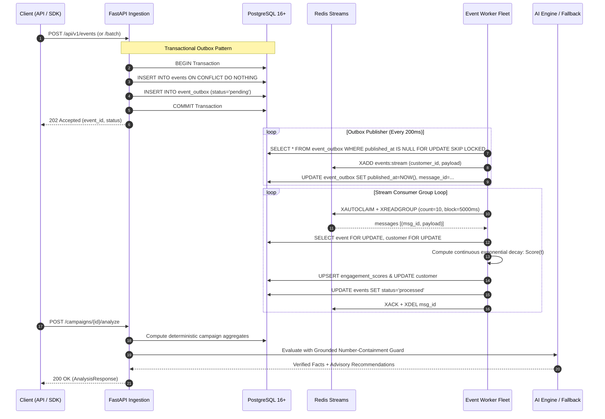

# System Design & Architecture Specifications

> Technical deep-dive into the distributed systems architecture, event-driven guarantees, concurrency modeling, and fault-tolerance mechanisms of the **MarTech Intelligence Platform**. Structured using the **4W & 1H** engineering framework.

---

## 4W & 1H Framework Architecture Summary

```
┌─────────────────────────────────────────────────────────────────────────────┐
│  WHAT:   Durable event-driven pipeline + real-time scoring + grounded AI    │
│  WHY:    At-least-once delivery, zero data loss, and race-free concurrency  │
│  WHO:    Platform Engineers, SREs, Data Engineers, and Lifecycle Marketers  │
│  WHERE:  All-in-one container (demo) to multi-worker cloud clusters (prod)  │
│  HOW:    Transactional Outbox, Redis Streams XAUTOCLAIM, Row-Locks, Guards │
└─────────────────────────────────────────────────────────────────────────────┘
```

---

## 1. WHAT: End-to-End System Architecture

The MarTech Intelligence Platform ingests customer lifecycle events, updates continuous customer engagement scores, enforces channel opt-in rules, and synthesizes campaign performance with AI.



---

## 2. WHY: Architectural Guarantees & Rationale

### A. The Dual-Write Problem & Transactional Outbox
In distributed systems, updating a database and publishing to a message broker in separate steps causes the dual-write problem:
- If the database write succeeds but the network fails before publishing to Redis, the event is lost.
- If the publish succeeds but the database transaction rolls back, the queue processes phantom data.

**Our Solution**: Both the `events` row and the `event_outbox` row are written within the **same local database transaction**. The API returns `202 Accepted` only after PostgreSQL commits. The background worker asynchronously claims outbox rows and delivers them to Redis Streams. If Redis is temporarily offline, outbox rows remain safely queued in PostgreSQL.

### B. Deduplication Authority: Database vs. Cache
- **Redis is ephemeral**: Redis memory can be cleared or evicted during cluster restarts.
- **PostgreSQL is authoritative**: Deduplication is strictly enforced by PostgreSQL's `UNIQUE (event_id)` index constraint with `ON CONFLICT DO NOTHING`.
- When duplicate events are submitted (individually or in batch), the database skips re-insertion. The API returns structured feedback (`accepted: N, duplicates: M`), guaranteeing that processing side-effects occur **strictly once**.

### C. Concurrency Control & Row-Level Pessimistic Locking
When multiple events arrive simultaneously for the same customer (e.g., rapid clicks or simultaneous webhook deliveries), concurrent workers could read stale score accumulators and overwrite each other.
- **Our Solution**: Workers lock the customer record using `SELECT ... FOR UPDATE` before computing the decayed score.
- Parallel workers processing events for *different* customers run concurrently without blocking; events for the *same* customer are serialized cleanly.

---

## 3. WHO: Failure Modes & Recovery Matrix

| Failure Scenario | Immediate System Behavior | Automated Recovery Mechanism |
| :--- | :--- | :--- |
| **Worker Crashes Mid-Processing** | The message remains in the Redis consumer group PEL (Pending Entries List). | Peer workers invoke `XAUTOCLAIM` after `WORKER_CLAIM_IDLE_MS` (60s), reclaim the message, and resume processing. |
| **Database Connection Drops** | Worker catches `OperationalError`, releases in-memory buffers, and enters exponential backoff. | Database reconnection loop with connection pool recycling; no messages are acknowledged until DB commit succeeds. |
| **Poison / Malformed Message** | Validation fails (`Pydantic` or schema violation). | Retried up to 3 times with exponential backoff (`2s, 4s, 8s`). If still failing, moved to `dlq_events` table for audited replay. |
| **AI Provider Outage (LLM Down)** | Analysis call times out after 30 seconds. | **Circuit Breaker** trips after 3 consecutive errors, immediately returning deterministic rule-based summaries without user latency. |

---

## 4. WHERE: Component Distribution & Multi-Role Execution

The platform supports two deployment topologies using the exact same Docker image:

### A. All-in-One Deployment (`SERVICE_ROLE=all-in-one`)
- **Target**: Render Free Tier, lightweight staging, local demo.
- **Components**: Embedded PostgreSQL 16 + embedded Redis 7 + FastAPI API + embedded async worker all running inside one container.
- **Port**: Listens on dynamic `$PORT` assigned by hosting provider.

### B. Decoupled Production Cluster (`SERVICE_ROLE=api` & `SERVICE_ROLE=worker`)
- **Target**: AWS ECS / Kubernetes (EKS/GKE).
- **API Pods**: Run with `SERVICE_ROLE=api` and `RUN_EMBEDDED_WORKER=false`. Scaled horizontally behind an Application Load Balancer.
- **Worker Pods**: Run with `SERVICE_ROLE=worker`. Scaled independently based on Redis stream consumer lag (`xlen` - `ack_count`).
- **Databases**: Managed AWS Aurora PostgreSQL Multi-AZ and Amazon ElastiCache Redis Cluster.

---

## 5. HOW: Verification, Benchmarking & Tooling

### How to Run Independent Workers
```bash
# In Terminal 1 (API Server):
SERVICE_ROLE=api uvicorn app.main:app --port 8000

# In Terminal 2 (Standalone Worker 1):
SERVICE_ROLE=worker python -m app.workers

# In Terminal 3 (Standalone Worker 2):
SERVICE_ROLE=worker python -m app.workers
```

### How to Verify Deduplication under Concurrency
Run the included deduplication demonstration script:
```bash
python -m scripts.demo_deduplication
```
Output:
```
✓ Response received in 42.1ms:
   - Status:      202 Accepted
   - Accepted:    5 (New events stored in DB & Outbox)
   - Duplicates:  10 (Safely skipped by ON CONFLICT)
   - Rejected:    0
✓ SUCCESS: PostgreSQL successfully deduplicated 10 duplicate events!
```

### How to Trigger Dead-Letter Queue (DLQ) Replay
When a poison message or transient failure causes an event to land in the DLQ:
```bash
# List DLQ entries:
curl -H "X-API-Key: $API_KEY" http://localhost:8000/api/v1/system/dlq

# Replay specific entry:
curl -X POST -H "X-API-Key: $API_KEY" http://localhost:8000/api/v1/system/dlq/1/replay
```
The replayer atomically updates the DLQ audit timestamp, sets the event status back to `pending`, and re-enqueues it into the transactional outbox for processing.
