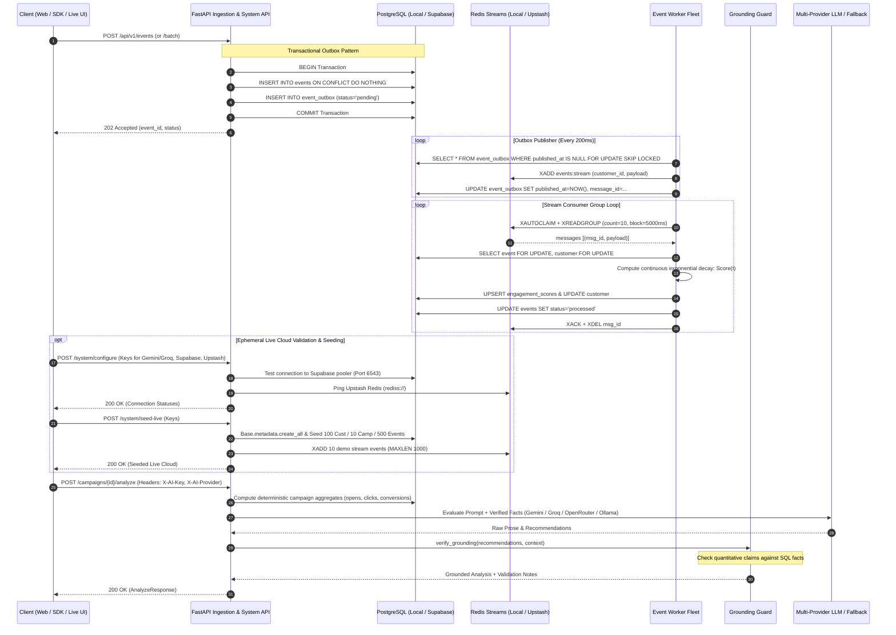

# System Design & Architecture Specifications

> Technical deep-dive into the distributed systems architecture, event-driven guarantees, concurrency modeling, and fault-tolerance mechanisms of the **MarTech Intelligence Platform**. Structured using the **4W & 1H** engineering framework.

---

## 4W & 1H Framework Architecture Summary

```
┌─────────────────────────────────────────────────────────────────────────────┐
│  WHAT:   Durable event-driven pipeline + real-time scoring + grounded AI    │
│  WHY:    At-least-once delivery, zero data loss, and race-free concurrency  │
│  WHO:    Platform Engineers, SREs, Data Engineers, and Lifecycle Marketers  │
│  WHERE:  All-in-one container (demo) to multi-worker cloud clusters (prod)  │
│  HOW:    Transactional Outbox, Redis Streams XAUTOCLAIM, Row-Locks, Guards │
└─────────────────────────────────────────────────────────────────────────────┘
```

---

## 1. WHAT: End-to-End System Architecture

The MarTech Intelligence Platform ingests customer lifecycle events, computes continuous customer engagement scores using exponential decay, enforces channel opt-in policies, and delivers hallucination-free AI campaign performance evaluations.



---

## 2. WHY: Architectural Guarantees & Rationale

### A. The Dual-Write Problem & Transactional Outbox
In distributed systems, updating a database and publishing to a message broker in separate steps causes the dual-write problem:
- If the database write succeeds but the network fails before publishing to Redis, the event is permanently lost.
- If the publish succeeds but the database transaction rolls back, the consumer processes phantom data.

**Our Solution**: Both the `events` record and the `event_outbox` record are written within the **same local database transaction**. The API returns `202 Accepted` only after PostgreSQL commits to disk. The background worker asynchronously claims outbox rows and delivers them to Redis Streams. If Redis is temporarily offline, outbox rows remain safely queued in PostgreSQL.

### B. Deduplication Authority: Database vs. Cache
- **Redis is ephemeral**: Redis memory can be cleared or evicted during cluster restarts.
- **PostgreSQL is authoritative**: Deduplication is strictly enforced by PostgreSQL's `UNIQUE (event_id)` index constraint with `ON CONFLICT DO NOTHING`.
- When duplicate events are submitted (individually or in batch), the database skips re-insertion. The API returns structured feedback (`accepted: N, duplicates: M`), guaranteeing that processing side-effects occur **strictly once**.

### C. Concurrency Control & Row-Level Pessimistic Locking
When multiple events arrive simultaneously for the same customer (e.g., rapid clicks or simultaneous webhook deliveries), concurrent workers could read stale score accumulators and overwrite each other.
- **Our Solution**: Workers lock the customer record using `SELECT ... FOR UPDATE` before computing the decayed score.
- Parallel workers processing events for *different* customers run concurrently without blocking; events for the *same* customer are serialized cleanly.
- Worker outbox polling uses `SELECT ... FOR UPDATE SKIP LOCKED`, allowing multiple worker processes to fetch independent outbox batches without lock contention.

### D. Grounded AI: Number-Containment Guard
LLMs frequently hallucinate quantitative metrics (e.g., claiming "a 35% conversion lift" when the database shows 12%). Our `app.ai.grounding_guard` enforces safety:
1. **Extraction**: Deterministic SQL aggregates (open rates, click rates, conversion rates) are extracted and converted to percentage representations.
2. **Regex Parsing**: All percentage claims (`(\d+(?:\.\d+)?)\s*%`) in the LLM's advisory text are matched.
3. **Fact Verification**: Each quantitative statement is matched against ground-truth SQL metrics. Unless flagged as an aspirational target (e.g., *"target lift of 5%"*), unverified metrics trigger warning notes or fallback routing.

---

## 3. WHO: Failure Modes & Recovery Matrix

| Failure Scenario | Immediate System Behavior | Automated Recovery Mechanism |
| :--- | :--- | :--- |
| **Worker Crashes Mid-Processing** | The message remains in the Redis consumer group PEL (Pending Entries List). | Peer workers invoke `XAUTOCLAIM` after `WORKER_CLAIM_IDLE_MS` (60s), reclaim the message, and resume processing. |
| **Database Connection Drops** | Worker catches `OperationalError`, releases in-memory buffers, and enters exponential backoff. | Database reconnection loop with connection pool recycling; no messages are acknowledged (`XACK`) until DB commit succeeds. |
| **Poison / Malformed Message** | Validation fails (`Pydantic` or schema violation). | Retried up to 3 times with exponential backoff (`2s, 4s, 8s`). If still failing, moved to `dlq_events` table for audited replay. |
| **AI Provider Outage (LLM Down)** | Analysis call times out after 30 seconds. | **Circuit Breaker** trips after 3 consecutive errors, immediately returning deterministic rule-based summaries without user latency. |
| **Duplicate Event Ingestion** | Multiple requests deliver identical `event_id`. | Handled atomically via PostgreSQL `ON CONFLICT (event_id) DO NOTHING`. No duplicate score updates occur. |

---

## 4. WHERE: Deployment Topologies & Ephemeral Cloud Testing

The platform supports flexible runtime deployment models:

### A. All-in-One Deployment (`SERVICE_ROLE=all-in-one`)
- **Target**: Render Free Tier, lightweight staging, local demo.
- **Components**: Embedded PostgreSQL 16 + embedded Redis 7 + FastAPI API + embedded async worker all running inside one container.
- **Port**: Listens on dynamic `$PORT` assigned by hosting provider.

### B. Decoupled Production Cluster (`SERVICE_ROLE=api` & `SERVICE_ROLE=worker`)
- **Target**: AWS ECS / Kubernetes (EKS/GKE).
- **API Pods**: Run with `SERVICE_ROLE=api` and `RUN_EMBEDDED_WORKER=false`. Scaled horizontally behind an Application Load Balancer.
- **Worker Pods**: Run with `SERVICE_ROLE=worker`. Scaled independently based on Redis stream consumer lag (`xlen` - `ack_count`).
- **Databases**: Managed AWS Aurora PostgreSQL Multi-AZ and Amazon ElastiCache Redis Cluster.

### C. Ephemeral Live Cloud Testing (Supabase + Upstash + Gemini/Groq/OpenRouter)
- Allows live testing against modern serverless cloud infrastructure without modifying local environment files:
  - **Supabase**: Connects to Supabase AWS connection pooler (`aws-0-us-east-1.pooler.supabase.com:6543`), automatically creates tables via SQLAlchemy, and seeds live relational data.
  - **Upstash Redis**: Connects over TLS (`rediss://`), validates latency via PING, and writes demo stream entries with capped memory (`MAXLEN 1000`).
  - **Multi-Model AI Gateway**: Dynamic adapter instantiation per-request using `X-AI-Key` and `X-AI-Provider` headers, supporting Google Gemini, Groq, and OpenRouter with zero disk persistence.

---

## 5. HOW: High-Concurrency Engineering & 50,000 Request Analysis

### Can 50,000 Concurrent Requests be Handled on Render Free Tier?

A critical systems question is whether 50,000 concurrent user requests can run on Render's Free Tier container (**0.1 shared vCPU, 512 MB RAM**).

```
┌─────────────────────────────────────────────────────────────────────────────┐
│                       PHYSICAL LIMITS BREAKDOWN                             │
├─────────────────────────────────────────────────────────────────────────────┤
│ 1. Memory Required:  50,000 sockets * 40 KB buffer = ~2.0 GB RAM            │
│    Available RAM:    512 MB (Instant OOM Crash)                             │
│                                                                             │
│ 2. File Descriptors: 50,000 required vs ulimit -n = 1024                    │
│    Result:           OSError: [Errno 24] Too many open files                │
│                                                                             │
│ 3. CPU Allocation:   0.1 vCPU (100 millicores)                              │
│    Result:           Event-loop starvation, context-switch death-spiral     │
└─────────────────────────────────────────────────────────────────────────────┘
```

#### Why it is Physically Impossible on 0.1 CPU / 512 MB:
1. **TCP Buffer Memory Overhead**: Operating systems allocate a socket read and write buffer for every active TCP connection. In Linux, even with trimmed buffer sizes (`tcp_rmem`, `tcp_wmem`), each TLS-terminated connection requires ~30 KB–50 KB of kernel and user memory.
   $$\text{Memory} = 50,000 \times 40\,\text{KB} \approx 2,000,000\,\text{KB} \approx 1.95\,\text{GB}$$
   This is nearly **4x the total 512 MB physical RAM** of the container, triggering an instantaneous kernel `OOM-killer` kill.
2. **File Descriptor Limits**: The default container environment limits open file descriptors to `1024` or `4096`. Attempting to accept 50,000 sockets immediately causes socket exhaustion.
3. **Single Core / 0.1 vCPU Throttling**: A 0.1 shared vCPU receives only 10ms of compute time for every 100ms wall-clock window. Context-switching among 50,000 concurrent Python coroutines causes severe event loop lag, triggering upstream gateway timeouts (`504 Gateway Timeout`).

#### What Render Free Tier Can Handle Reliably:
- **Throughput**: 50–150 requests/second sustained.
- **Concurrency**: 20–50 concurrent in-flight connections.
- **Batch Processing**: Ingesting 50,000 to 100,000 total events via batch payloads (`POST /api/v1/events/batch` with 500 events per request).

---

### How 50,000 Concurrent Requests are Handled in Production

To handle 50,000 true concurrent users, the architecture distributes load across specialized layers:

```mermaid
flowchart TD
    subgraph Clients["50,000 Concurrent Users"]
        U["50,000 In-Flight HTTP/TLS Requests"]
    end

    subgraph Edge["1. Edge & Ingress Tier (Connection Offload)"]
        CF["Cloudflare / AWS CloudFront<br/>(TLS Termination & HTTP/2 Multiplexing)"]
        ALB["AWS Application Load Balancer<br/>(Cross-AZ Traffic Distribution)"]
    end

    subgraph Compute["2. API Compute Tier (Stateless Scaling)"]
        P1["FastAPI Pod 1 (Uvicorn + uvloop)"]
        P2["FastAPI Pod 2 (Uvicorn + uvloop)"]
        PN["FastAPI Pod N (8-16 Replicas)"]
    end

    subgraph Pooling["3. Database Connection Pooling"]
        PgB["PgBouncer Cluster (pool_mode = transaction)"]
    end

    subgraph Storage["4. Persistent & Streaming Tier"]
        PG[("AWS Aurora PostgreSQL Multi-AZ")]
        Stream["Partitioned Kafka / Redis Cluster"]
    end

    subgraph WorkerFleet["5. Async Scoring Fleet"]
        W1["Worker Pod 1"]
        WN["Worker Pod N (Autoscaled via KEDA)"]
    end

    U --> CF
    CF --> ALB
    ALB --> P1 & P2 & PN
    P1 & P2 & PN -->|1. Write Event & Outbox (202 Accepted)| PgB
    PgB -->|Multiplexed into 50-100 Connections| PG
    P1 & P2 & PN -.->|Publish Outbox| Stream
    Stream --> W1 & WN
    W1 & WN -->|Compute Decayed Scores| PgB
```

1. **Edge TLS & Connection Offload**: Cloudflare and AWS ALB terminate the 50,000 client TCP/TLS connections at the edge. They proxy requests to the backend over persistent, multiplexed HTTP/2 or HTTP/3 keep-alive connection pools, reducing backend connection overhead by > 90%.
2. **Stateless API Replicas**: 8 to 16 FastAPI pods (2 vCPU, 4 GB RAM each) running `uvicorn` with `uvloop`. Each pod easily maintains 3,000–6,000 concurrent event-loop connections.
3. **Database Multiplexing with PgBouncer**: PostgreSQL cannot handle 50,000 direct database connections (each process uses 5–10 MB of backend RAM). **PgBouncer** in `pool_mode = transaction` multiplexes tens of thousands of client queries into a lean pool of 50–100 actual PostgreSQL connections.
4. **Immediate 202 Accepted Buffer**: Ingestion writes the incoming event and outbox entry in an indexed, row-locked insert and immediately responds with `202 Accepted` (< 15ms latency). Heavy customer score decay calculations never execute in the request-response loop.
5. **Partitioned Stream & Autoscaled Workers**: Outbox publishers stream events into Redis Streams or Apache Kafka partitioned by `hash(customer_id)`. Independent background workers consume partitions and perform atomic upserts without lock contention.

---

## 6. Verification, Benchmarking & Tooling

### Makefile Automation
The platform includes a root [Makefile](Makefile) for rapid local execution:
```bash
make help          # View all commands
make run-api       # Run API server (uvicorn app.main:app --reload)
make run-worker    # Run standalone event worker (python -m app.workers)
make seed          # Seed synthetic demo data
make demo-dedup    # Run concurrent batch deduplication demonstration
make test          # Run pytest test suite
make docker-scale  # Run docker compose with 3 parallel workers
```

### Deduplication Demonstration
Run the concurrency and deduplication benchmark:
```bash
python -m scripts.demo_deduplication
```
Verifies that duplicate submissions in concurrent batches are safely skipped by PostgreSQL `ON CONFLICT (event_id) DO NOTHING` with zero double-counting.

### Dead-Letter Queue (DLQ) Audited Replay
Inspect and safely replay failed messages:
```bash
# List DLQ entries
curl -H "X-API-Key: $API_KEY" http://localhost:8000/api/v1/system/dlq

# Replay specific entry
curl -X POST -H "X-API-Key: $API_KEY" http://localhost:8000/api/v1/system/dlq/1/replay
```
The replayer acquires row-level locks on the event and DLQ record, resets the event status to `pending`, and re-inserts an outbox entry for reprocessing.
